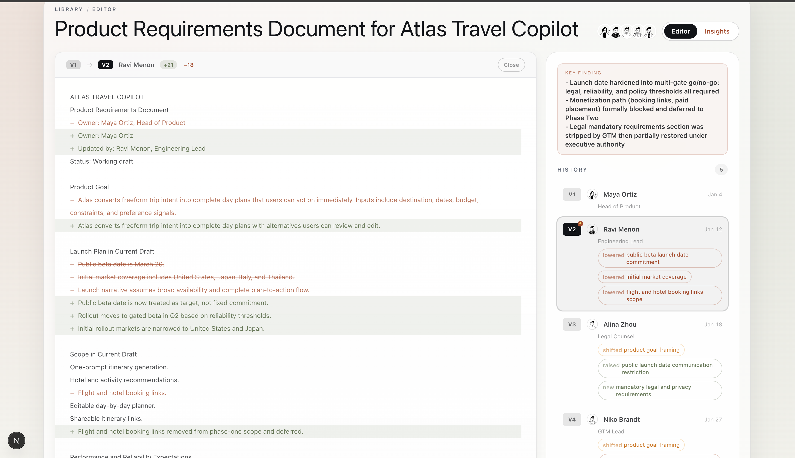

# Drift - A document editor that tracks semantic diffs across edits 

**See how meaning moves through your documents.**

Most collaboration tools track what changed. Drift tracks *what it means* — surfacing the moment a launch plan became tentative, a contract shifted liability, or a product goal was quietly reframed.

---


---

## The problem Drift solves

High-stakes documents go through many hands. Each revision feels small. But over five versions, a "committed Q2 launch" becomes "phased beta pending legal approval." No single edit caused it — the meaning drifted.

Drift makes that visible in seconds.

---

## How it works

### 1. Write and snapshot as you iterate

Open a document, write your draft, and save a snapshot after each meaningful revision. Each snapshot captures who wrote it, their role, and the full text. The sidebar shows your version history live.


> **V1 → V5** in one view. Each contributor's avatar, role, and the specific semantic changes they introduced — raised commitments, removed scope, new legal requirements — all visible without opening a diff.

### 1b. Review semantic diff with AI context

Drift surfaces decision-level meaning changes across versions and keeps evidence visible so teams can understand impact fast.



---

### 2. See the full journey

After two or more snapshots, Drift analyzes every transition in parallel and builds a timeline of how intent evolved across the entire document lifecycle.


> The headline tells you the verdict immediately. The timeline shows every contributor and what they actually changed — not just the text, but the *meaning*: `raised public beta launch date commitment`, `removed flight and hotel booking links`, `new mandatory legal and privacy requirements`.

---

### 3. Find the turning point and next action

Drift identifies the single transition that changed the document the most, who was responsible, and what question needs answering before the team can move forward.


> The turning point pins the exact version where direction fundamentally shifted. The alignment section shows which two people need to get on the same page. The recommended action is specific enough to put directly in a Slack message or meeting agenda.

---

## What Drift tracks

| Signal | What it means |
|---|---|
| **Drift Score** | How much total meaning has shifted (0–100) |
| **Turning Point** | The single transition with the highest semantic weight |
| **Drift Items** | Individual changes — `strengthened`, `weakened`, `shifted`, `appeared`, `disappeared` |
| **Significance** | `high` / `medium` / `low` weighted by impact |
| **Who Needs to Align** | The two stakeholders most responsible for the divergence |
| **Recommended Next Step** | A concrete, specific action to resolve the misalignment |

---

## Use cases

**Product specs and PRDs** — Catch when scope quietly expands, launch authority shifts, or success criteria get weakened between engineering and legal reviews.

**Contracts** — Track changes in obligations, liability caps, and compliance language before sign-off. Spot reframes that look like copyedits.

**Investment memos** — See when a recommendation shifts from conviction to conditional, or when the core thesis changes between drafts.

**Cross-functional handoffs** — Understand which team introduced which risk, and who needs to reconcile before the next decision gate.

---

## Quickstart

```bash
npm install
npm run dev
```

Open `http://localhost:3000`. No account required — documents save to `localStorage` automatically.

To try it immediately, click **Load Demo** from the library. Drift ships with five realistic scenarios (contract negotiation, product PRD, investment memo, API deprecation, post-acquisition plan) that you can analyze instantly.

### Environment variables

```bash
# Required for AI analysis
ANTHROPIC_API_KEY=sk-ant-...

# Optional: Neon Postgres (required for cross-device persistence)
DATABASE_URL=postgresql://...

# Optional: pin model
ANTHROPIC_MODEL=claude-sonnet-4-6

# Optional: allow mock analysis without API key (dev only)
ALLOW_MOCK_ANALYSIS=true
```

---

## Technical overview

### Stack

| Layer | Technology |
|---|---|
| Framework | Next.js 15 (App Router) |
| Language | TypeScript |
| Styling | Tailwind CSS v4 |
| Rich text | Tiptap |
| Auth | Clerk |
| Database | Neon (serverless Postgres) |
| ORM | Drizzle |
| AI | Anthropic Claude (claude-sonnet-4-6) |
| Deployment | Vercel |

---

### Architecture

```
app/
├── page.tsx                  # Main client shell (all document state lives here)
├── layout.tsx                # ClerkProvider (optional, key-gated)
└── api/
    ├── analyze/              # POST — parallel transition analysis
    │   └── synthesis/        # POST — headline / narrative / recommended_action
    ├── documents/            # GET list, POST create
    │   └── [id]/             # GET, PUT, DELETE, HEAD
    └── demo/                 # GET — pre-built scenario catalog

components/
├── editor-panel.tsx          # Editor + diff viewer + version history sidebar
├── analysis-view.tsx         # Insights page composition
├── brief/
│   ├── verdict-header.tsx    # Headline + drift score
│   ├── journey-timeline.tsx  # Full version-by-version timeline
│   ├── turning-point.tsx     # Inflection transition detail
│   ├── alignment-panel.tsx   # Who needs to align
│   └── action-card.tsx       # Recommended next step
└── clerk-user-sync.tsx       # SSR-safe useUser() bridge (ssr: false)

lib/
├── store.ts                  # Document persistence (localStorage + DB dual-write)
├── db/
│   ├── index.ts              # Drizzle + Neon HTTP driver
│   └── schema.ts             # documents table schema
└── types.ts                  # Shared TypeScript types
```

---

### Analysis pipeline

Each analysis runs in two phases to keep the UI fast:

**Phase 1 — Transitions** (`/api/analyze`)
Sends all version pairs in parallel to Claude with a template-aware prompt. Returns structured `DriftItem[]` with type, element, significance, evidence, and a question to ask. Also returns per-version intent summaries.

**Phase 2 — Synthesis** (`/api/analyze/synthesis`)
Runs after the UI already shows drift data. Generates the headline, narrative, and recommended action given the full drift picture and author context.

**Incremental analysis**
When a new snapshot is added to an existing analysis, only the single new transition is computed and merged — not a full re-run. This keeps background analysis fast as documents grow.

---

### Persistence model

Documents are persisted in two layers simultaneously:

1. **localStorage** — written synchronously on every change, always available, works without auth or network
2. **Postgres (Neon)** — written async, best-effort, scoped by Clerk `userId`

If the API returns 401 (unauthenticated) or 5xx (no `DATABASE_URL`), the store silently falls back to localStorage. Authenticated users get cross-device sync automatically.

```
saveDocument(doc)
  → localSave(doc)           // immediate, always
  → HEAD /api/documents/:id  // check existence
  → POST or PUT              // upsert to Postgres
  // any failure: already saved to localStorage, nothing lost
```

---

### Document schema

```ts
{
  id: string                  // UUID
  userId: string              // Clerk user ID
  title: string
  template: "product_spec" | "contract" | "prd" | "memo"
  draftHtml: string           // Current editor state (Tiptap HTML)
  draftPlainText: string      // Plaintext for analysis
  snapshots: EditorSnapshot[] // JSONB — full version history
  analysis: AnalysisResult | null  // JSONB — last analysis output
  createdAt: string           // ISO timestamp
  updatedAt: string
}
```

---

### Adding a new demo scenario

Demo scenarios live in `/app/api/demo/route.ts`. Each scenario is a JSON object with `title`, `template`, and `versions[]` — each version has `content`, an optional `timestamp`, and author metadata (`author_name`, `author_role`, `author_handle`, `author_avatar_url`).

The demo endpoint also powers the catalog shown in the library so users can browse scenarios before loading one.
